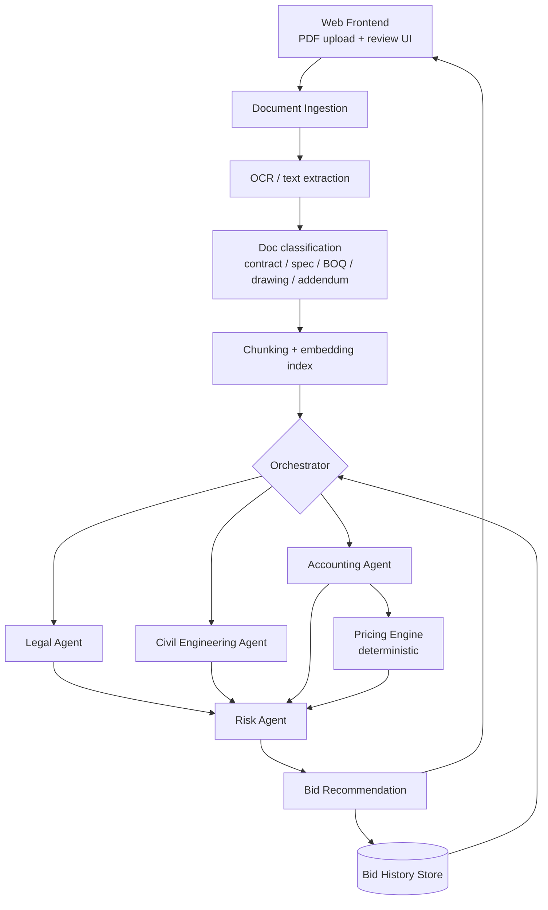

# Tender Assistant — Project Charter & Technical Starter

**Status:** Charter v0.1 — partially implemented. This document describes the
*intended* design, not the current build. See
[§0 Implementation Status](#0-implementation-status) for what actually exists.
**Owners:** 4 contributors (see [Work Breakdown](#work-breakdown))
**Last updated:** 2026-08-22

---

## 0. Implementation Status

This charter predates the build. Read it as design intent, and read
[IMPLEMENTATION_STATUS.md](./IMPLEMENTATION_STATUS.md) and
[AGENTS_COMPLETE_GUIDE.md](./AGENTS_COMPLETE_GUIDE.md) for the current system.

**Built as designed:**

| Charter section | Status |
|---|---|
| §4 DAG shape — orchestrator → legal/civil/accounting in parallel → risk last | ✅ `python/graph/pipeline.py` |
| §3.3 LLM extracts, deterministic code computes | ✅ `pricing_engine`, `risk_agent` — both LLM-free |
| §3.2 Every finding carries a citation | ⚠️ Weakest link. Citations are required by prompt and carried inline, but **the live Python pipeline never verifies coverage** — `lib/citation-tracker.ts` was not ported. The legacy TS agents do check, and even there a failure is logged, not enforced by dropping the finding. The charter's "unsourced finding is treated as a hallucination and dropped" rule is not implemented anywhere |
| §4.2 Postgres + pgvector, FastAPI backend | ✅ |
| §5 Four consultant agents | ✅ All four exist |

**Not yet built — the charter describes these but the code does not implement them:**

| Charter item | Reality |
|---|---|
| §3.1 Versioned output schemas (`schema_version`) | No schema versioning anywhere |
| §3.4 `confidence` and `unknowns[]` on every agent output | Not implemented. Agents emit plain `string[]` lists; there is no abstention mechanism |
| §5.1 Legal `findings[]` with `id`, `severity`, `clause_type`, `blocking_issues[]` | Actual shape is `{compliance_issues[], contract_terms[], risks[], overall_assessment}` |
| §5.2 `capability_gaps[]`, `information_requests[]` (RFIs) | Not implemented. The RFI output the charter calls "one of the most valuable things this app can produce" does not exist |
| §5.3 Cost library, `recommended_bid_range{low,target,high}`, `cash_flow_profile` | Pricing engine uses fixed default percentages, not a bidder cost library |
| §5.4 `overall_risk_pct`, `risk_register[]` with likelihood/impact, `recommended_contingency_pct` | Actual risk output is `{risk_score, risk_level, risk_factors[], mitigation_strategies[], recommendation, bid_decision, ...}`. Contingency and margin are **fixed defaults in the pricing engine**, not risk-agent outputs — so the charter's "how the risk score turns into money" coupling (§5.3) is not wired up |
| §3.5 Review queue, finding accept/edit/dismiss, overrides as training signal | Not implemented |
| §6 Bid history & calibration (outcomes, hit rates, estimate drift) | Not implemented. Bids are stored, outcomes are not |
| §4.2 Queue (Celery/RQ + Redis), async from day one | Not implemented — `/api/analyze` runs the pipeline synchronously in the request |
| §4.1 OCR fallback for scanned sheets | Not implemented — scanned PDFs without a text layer are rejected outright |
| §4.2 `pymupdf`, S3 object store | Uses `pypdf` (Python) / `pdf-parse` (TS); Vercel Blob for storage |
| Appendix A repository layout | Diverged — see the structure in [README.md](./README.md) |
| §7 Four-person work breakdown | Historical. Not a description of who works on what now |

**Open questions in §10 that remain open:** Q1 (`overall_risk_pct` definition —
note the implemented `risk_score` is a 0-1 composite index, which answers Q1 by
default rather than by decision) and Q2 (cost library source) are both still
unresolved and still blocking the features above.

---

## 1. Problem Statement

A construction bidder receives a tender package (PDFs) from a project owner and must decide, under time pressure:

1. **Should we bid at all?** (go / no-go)
2. **What number do we submit?** (a price that wins *and* makes money)
3. **What are we exposed to if we win?** (risk quantification)

Today this requires pulling in legal, engineering, estimating, and management review — expensive, slow, and inconsistent. This application automates the first pass and produces a structured, auditable recommendation that a human decision-maker signs off on.

## 2. Product Goals

- Ingest a tender package (multi-document PDF set) and produce a **structured bid recommendation** within minutes.
- Route the package through four specialist **consultant agents** (legal, civil, accounting, risk).
- Produce a defensible **bid number** and **risk percentage**, with every claim traceable to a source page.
- Maintain a **bid history** so the system learns where this bidder actually wins and where their estimates drift.

### Non-Goals (v1)

Naming these now prevents scope creep later.

- Not a full estimating/takeoff replacement (no quantity takeoff from drawings/CAD).
- Not a legal opinion — it flags clauses for human counsel, it does not advise.
- Not automated bid *submission* to any owner portal.
- No multi-tenant SaaS hardening in v1; assume a single bidder organization.

## 3. Core Design Principles

These are the decisions that will make or break the build. Agree on them before writing code.

### 3.1 Agents emit structured data, never prose blobs

Every agent returns JSON conforming to a versioned schema. Prose is a *field* inside the output, not the output. This is what makes the results comparable across bids, storable, chartable, and testable.

### 3.2 Every finding carries a citation

Each finding references `{document_id, page, excerpt}`. An unsourced finding is treated as a hallucination and dropped at validation. Bidders will not trust — and should not trust — a risk score they can't trace to a contract clause.

### 3.3 The LLM extracts; deterministic code computes

**This is the most important rule in the document.** LLMs are unreliable at arithmetic across long documents. The accounting agent must *not* be asked "what should we bid?" and hand back a number.

Instead:

- LLM extracts line items, quantities, units, durations, and stated conditions → structured records.
- A **deterministic pricing engine** (plain Python, fully unit-tested) computes cost, overhead, contingency, and final bid price.
- The LLM then *explains* the computed number.

Same rule for the risk score: agents emit weighted risk factors; a scoring function turns them into a percentage.

### 3.4 Confidence and abstention are first-class

Every agent output includes a confidence level and an explicit `unknowns[]` list. "I could not find the liquidated damages clause" is a valuable, actionable output. Silent guessing is not.

### 3.5 Human-in-the-loop by default

The system produces a **recommendation with a review queue**, never an auto-submitted bid. Every agent finding is acceptable / editable / dismissible by the user, and those edits become training signal (see §6).

---

## 4. System Architecture



**Note the shape:** this is a DAG, not a fan-out. The risk agent runs *last* and consumes the other three outputs — its whole job is synthesis. Legal, civil, and accounting run in parallel.

### 4.1 Layers

| Layer | Responsibility |
|---|---|
| **Frontend** | Upload, job status, results dashboard, finding review/override, history views |
| **Ingestion** | OCR (scanned drawings are common), text/table extraction, doc classification, chunking, retrieval index |
| **Orchestration** | DAG execution, retries, schema validation, cost/token tracking, run logging |
| **Agents** | Four domain specialists; prompt + tools + output schema each |
| **Pricing Engine** | Deterministic cost buildup and bid price calculation |
| **History & Calibration** | Past bids, outcomes, estimate-vs-actual drift, hit rates |

### 4.2 Suggested Stack

Placeholder — swap for whatever the team knows best. Familiarity beats novelty on a 4-person project.

- **Frontend:** React + TypeScript
- **Backend:** Python (FastAPI) — the PDF/ML ecosystem lives here
- **Queue:** Celery/RQ + Redis (tender packages take minutes, not milliseconds — this must be async from day one)
- **DB:** Postgres + `pgvector` (one datastore instead of two)
- **Storage:** S3-compatible object store for source PDFs
- **PDF:** `pymupdf` for native text, OCR fallback for scanned pages

---

## 5. The Four Consultant Agents

Each agent needs: a scope, an input filter (which documents it sees), an output schema, and a set of eval cases.

### 5.1 Legal Agent

**Question:** *Are there contractual terms that make this dangerous or unacceptable?*

**Reads:** contract conditions, general/special conditions, insurance and bonding requirements, addenda.

**Checklist (starting point — expand with a real practitioner):**

- Payment terms, retainage, pay-when-paid clauses
- Liquidated damages: rate and cap
- Indemnification scope, limitation of liability
- Warranty period and scope
- Change order and claims procedure; notice deadlines
- Termination for convenience
- Dispute resolution venue and mechanism
- Bonding, insurance, licensing prerequisites
- Governing law / jurisdiction

**Output:**

```json
{
  "agent": "legal",
  "schema_version": "1.0",
  "findings": [
    {
      "id": "LGL-004",
      "clause_type": "liquidated_damages",
      "severity": "high",
      "summary": "LDs assessed at 0.5%/day with no stated cap.",
      "why_it_matters": "Uncapped LDs create unbounded downside on a schedule-risky scope.",
      "citation": {"document_id": "doc_3", "page": 42, "excerpt": "..."},
      "confidence": 0.88,
      "recommended_action": "escalate_to_counsel"
    }
  ],
  "unknowns": ["No insurance certificate requirements located in package."],
  "blocking_issues": ["LGL-004"],
  "overall_assessment": "conditional"
}
```

### 5.2 Civil Engineering Agent

**Question:** *Can we actually build this, with our people and equipment, in the stated time?*

**Reads:** technical specifications, scope of work, drawings (text/annotations), site conditions, schedule/milestones.

**Assesses:** scope clarity, spec/drawing conflicts, constructability red flags, unusual methods or materials, site access and geotechnical unknowns, schedule feasibility vs. scope, required specialist subcontractors, capability gaps vs. bidder's known capabilities from history.

**Output:** `feasibility_rating`, `technical_findings[]` (each with severity + citation), `capability_gaps[]`, `schedule_assessment`, `information_requests[]` (RFIs the bidder should send the owner *before* pricing).

> The `information_requests[]` output is quietly one of the most valuable things this app can produce. Ambiguity found before bid is a free RFI; found after award it's a claim, or a loss.

### 5.3 Accounting / Estimating Agent

**Question:** *What does this cost us, and what do we submit?*

**Reads:** bill of quantities, pricing schedules, payment terms, scope, escalation/currency clauses.

**Pipeline:**

1. **Extract** (LLM): line items, quantities, units, allowances, provisional sums, exclusions.
2. **Price** (deterministic engine): unit costs from the bidder's cost library × quantities → direct cost.
3. **Build up** (deterministic): direct cost → indirects → overhead → contingency → margin → bid price.
4. **Explain** (LLM): narrate the buildup, flag the largest cost drivers and the assumptions most likely to be wrong.

**Contingency and margin are inputs from the risk agent, not invented here.** That coupling is deliberate — it's how the risk score turns into money.

**Output:** `cost_breakdown{}`, `recommended_bid_range{low, target, high}`, `expected_margin_pct`, `cash_flow_profile` (payment terms + retainage can make a profitable job insolvent), `assumptions[]`, `estimate_confidence`.

### 5.4 Business Risk Management Agent

**Question:** *What is our overall exposure, and should we walk away?*

**Reads:** the outputs of the other three agents, plus bid history.

**Risk register categories:** contractual/legal, technical/constructability, schedule, financial/cash flow, counterparty (owner payment history, funding source), market (material escalation, labor availability), capability fit, opportunity cost.

**Output:**

```json
{
  "agent": "risk",
  "overall_risk_pct": 34,
  "risk_band": "moderate-high",
  "recommendation": "bid_with_conditions",
  "risk_register": [
    {
      "id": "RSK-002",
      "category": "financial",
      "description": "60-day payment terms with 10% retainage against a 14-month schedule.",
      "likelihood": 0.6,
      "impact": "high",
      "weighted_score": 0.42,
      "source_findings": ["LGL-004", "ACC-011"],
      "mitigation": "Price working capital cost into indirects; negotiate retainage reduction at 50% completion."
    }
  ],
  "recommended_contingency_pct": 8.5,
  "recommended_margin_pct": 12.0,
  "go_no_go_rationale": "..."
}
```

**Define `overall_risk_pct` precisely and write it down.** "34% risk" is meaningless unless everyone agrees whether it means *probability of losing money*, *expected cost overrun as a percentage*, or *a normalized composite index*. Pick one, document it in the UI tooltip, and hold to it. Ambiguity here will make the whole product feel untrustworthy.

---

## 6. Bid History & Calibration

### What to store per bid

- Project metadata: type, size, duration, owner, location, delivery method
- Full agent outputs (versioned — you need them to diagnose regressions)
- Recommended bid vs. **actual submitted bid** (the delta is signal: it shows where the human overrides the machine)
- Outcome: won / lost / no-bid / withdrawn
- If lost: winning price and rank, where obtainable
- If won: **realized cost and margin at closeout** — the single most valuable field in the database
- Every human override of an agent finding

### What to compute

- Hit rate segmented by project type, size band, owner, and margin level
- Estimate accuracy: bid cost vs. realized cost, by trade — the drift curve
- Where this bidder's overrides are consistently *right* (that's a prompt or cost-library defect to fix)
- Competitiveness: average gap to winning bid on losses

### Be honest about the statistics

With fewer than ~50 completed bids, this is **descriptive analytics, not prediction**. Present it as "you have won 4 of 7 water infrastructure projects under $2M," not "68% predicted win probability." A fabricated probability is worse than no probability — it will get trusted and it will be wrong. Revisit modeling once the data justifies it.

---

## 7. Work Breakdown

### Sequencing rule

**Days 1–3: everyone works on contracts, not code.** The four output schemas (§5), the document store API, and the orchestrator interface get defined and merged first. Once those exist, four people can build in parallel against stubs without blocking each other. Skipping this is the single most likely way this project stalls.

Each person owns **one platform slice + one agent**, so no one is stuck purely on infrastructure and everyone touches the domain logic.

| | Person A | Person B | Person C | Person D |
|---|---|---|---|---|
| **Platform slice** | Ingestion & document services | Orchestration & agent framework | Pricing engine & cost library | Frontend & history/calibration |
| **Agent** | Legal | Risk | Accounting | Civil Engineering |

**Person A — Ingestion & Document Services + Legal Agent**
PDF upload handling, OCR fallback for scanned sheets, text and table extraction, document type classification, chunking strategy, retrieval index. Then the legal agent, which is the most retrieval-native of the four and the natural first consumer of the index.

**Person B — Orchestration & Agent Framework + Risk Agent**
DAG runner, retry/timeout handling, schema validation, LLM client abstraction, run logging, token/cost tracking, and the eval harness. Then the risk agent, which sits downstream of everything and is best built by whoever owns the plumbing between agents.

**Person C — Pricing Engine & Cost Library + Accounting Agent**
Deterministic cost buildup, cost library data model, cash flow modeling, sensitivity analysis. This slice is heavily unit-tested and lightly LLM-dependent. Then the accounting agent's extraction layer that feeds it.

**Person D — Frontend & History + Civil Engineering Agent**
Upload flow, job status, results dashboard, finding review/override UI, bid history views and calibration charts. Then the civil agent. Person D should also own the **user-facing legibility** of the whole product — if the recommendation can't be understood at a glance, nothing else matters.

### Shared / rotating responsibilities

- **Eval set curation.** Everyone contributes annotated tender packages. Budget real time for this; you cannot tune agents without ground truth.
- **Prompt review.** No prompt merges without a second reader.
- **Domain expert access.** Identify a real estimator, engineer, and construction lawyer you can put questions to. One hour with each will beat a week of guessing.

---

## 8. Milestones

**M1 — Skeleton (weeks 1–2)**
Upload a PDF, extract text, run one hardcoded agent, see JSON on screen. End to end, ugly, working.

**M2 — Four agents (weeks 3–5)**
All four agents produce schema-valid output with citations. Orchestrator runs the DAG. Pricing engine computes from extracted line items.

**M3 — Recommendation & review (weeks 6–8)**
Unified recommendation view. Human override flow. Bid record persisted with outcome tracking.

**M4 — History & calibration (weeks 9–11)**
Historical bids loaded, hit-rate and estimate-accuracy views live, risk agent consuming history.

**M5 — Hardening (weeks 12+)**
Eval suite green, failure modes handled, real tender package trialed end to end with a real bidder.

---

## 9. Data Handling

Tender packages are commercially sensitive — pricing strategy, cost libraries, and competitive positioning. Treat this as confidential-by-default:

- Encrypt documents at rest; scope access to the uploading organization.
- Be explicit about what leaves the environment via LLM API calls, and confirm the provider's data-retention terms. This may constrain model choice; find out early rather than late.
- Audit log every agent run and every human override — needed for trust and for post-mortems on bad recommendations.
- Retention policy for tender documents after a bid closes (an owner may contractually require destruction).

---

## 10. Open Questions

Resolve these with the team and, where noted, a domain expert.

1. **Define `overall_risk_pct` precisely.** Probability of loss? Expected overrun? Composite index? *(blocks the risk agent)*
2. **Where does the cost library come from?** Does the bidder have historical unit costs, or do we start from a commercial database? *(blocks the pricing engine — this is the biggest unknown in the project)*
3. **What is a realistic package size?** 50 pages or 5,000? Drives ingestion architecture and cost per run.
4. **How many historical bids exist, in what format?** Determines whether §6 is real on day one or aspirational.
5. **Single bidder org or multi-tenant?** Changes auth and data model materially.
6. **What is the acceptable latency and cost per analysis?** 5 minutes at $2, or 1 hour at $50? Both are defensible; they imply different designs.
7. **Which markets/jurisdictions?** The legal checklist is jurisdiction-dependent.

## 11. Key Risks to the Project Itself

| Risk | Mitigation |
|---|---|
| Agents hallucinate findings; users lose trust after one bad output | Citation enforcement, validation layer, confidence surfacing, human review gate |
| No ground truth to evaluate against | Curate an annotated eval set in weeks 1–2, before agent tuning |
| Cost library doesn't exist → accounting agent has nothing to price against | Resolve Q2 in week 1; consider a manual-entry fallback |
| Four people, one shared codebase, blocking dependencies | Contract-first sequencing (§7); build against stubs |
| Scope creep into full estimating software | Defend the Non-Goals list (§2) |
| Beautiful demo, useless in real workflow | Get a real bidder to run a real package by M3, not M5 |

---

## Appendix A — Repository Layout (proposed)

```
/frontend          # React app
/backend
  /ingestion       # PDF → text → classified, chunked, indexed
  /agents
    /legal
    /civil
    /accounting
    /risk
    /schemas       # versioned JSON schemas — the shared contract
  /pricing         # deterministic engine, heavily unit-tested
  /orchestration   # DAG runner, retries, validation, logging
  /history         # bid records, outcomes, calibration
/evals             # annotated tender packages + expected outputs
/docs
```

## Appendix B — Glossary

- **BOQ** — Bill of Quantities: itemized list of work and materials with quantities, priced by the bidder.
- **Provisional sum** — allowance for work not fully defined at tender.
- **Retainage** — percentage of payment withheld until completion.
- **Liquidated damages (LDs)** — pre-agreed penalty per day of delay.
- **Addendum** — owner-issued amendment to the tender package during the bid period.
- **RFI** — Request for Information submitted to the owner to clarify ambiguity.
